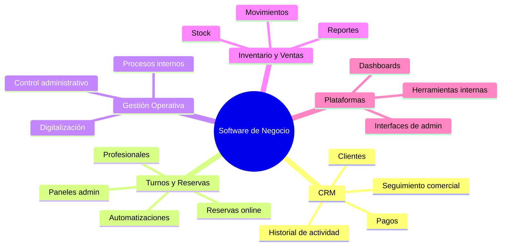
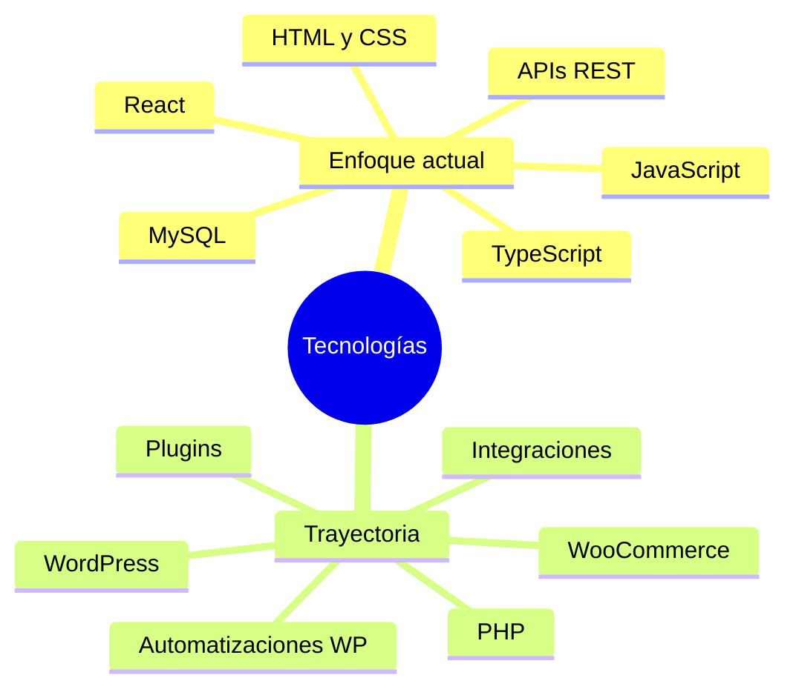
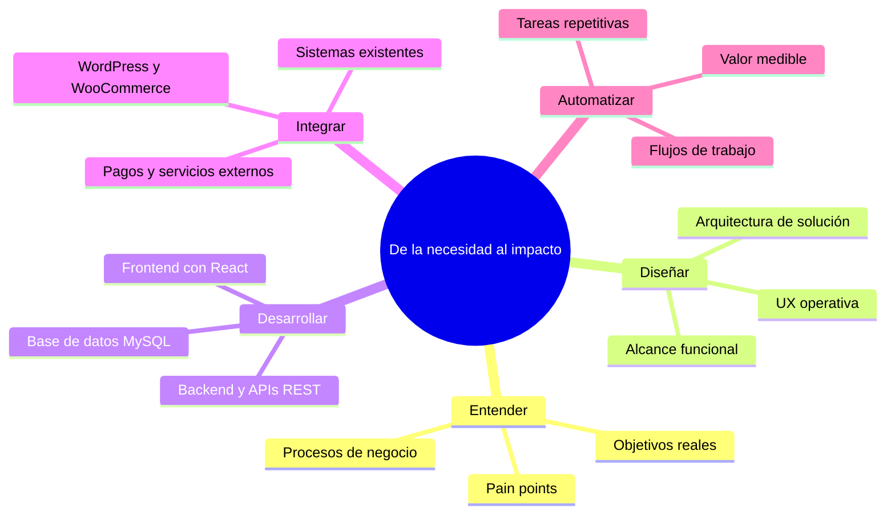
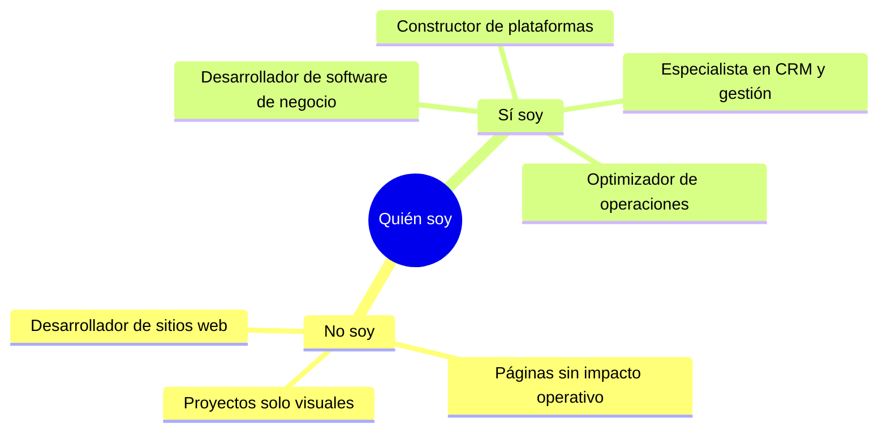

<h1>Facundo Esquivel</h1>
<h3>Desarrollador Full-Stack · Software orientado a negocios</h3>

> **Desarrollo software que resuelve problemas reales de negocio.**
>
> No construyo sitios web. Diseño y desarrollo **plataformas operativas** — sistemas que centralizan información, automatizan procesos y dan control real a las empresas sobre sus operaciones.
>
> Mi foco actual está en **React** y arquitecturas web modernas. Mi trayectoria incluye PHP, WordPress y WooCommerce, lo que me da una base sólida para integrar sistemas y entender entornos empresariales complejos.

<b>Qué Construyo</b>

<table>
<tr>
<td width="50%" valign="top">

**CRM**

- Clientes e historial
- Seguimiento comercial
- Pagos centralizados

</td>
<td width="50%" valign="top">

**Turnos & Reservas**

- Reservas online
- Gestión de profesionales
- Pagos y automatizaciones

</td>
</tr>
<tr>
<td width="50%" valign="top">

**Gestión Operativa**

- Procesos internos
- Control administrativo
- Digitalización de tareas

</td>
<td width="50%" valign="top">

**Inventario & Ventas**

- Control de stock
- Reportes comerciales
- Ventas integradas

</td>
</tr>
</table>

<b>Stack Tecnológico</b>

<table>
<tr>
<th align="left" width="50%">Enfoque actual</th>
<th align="left" width="50%">Trayectoria</th>
</tr>
<tr>
<td valign="top">

React, interfaces admin y backends de negocio.

</td>
<td valign="top">

PHP, WordPress, WooCommerce e integraciones.

</td>
</tr>
</table>

<b>Cómo Trabajo</b>

<table>
<tr>
<th align="left" width="8%">#</th>
<th align="left" width="22%">Etapa</th>
<th align="left" width="40%">Qué hago</th>
<th align="left" width="30%">Resultado</th>
</tr>
<tr>
<td align="left">01</td>
<td>Entender</td>
<td>Mapeo de procesos y objetivos</td>
<td>Problema definido</td>
</tr>
<tr>
<td align="left">02</td>
<td>Diseñar</td>
<td>Arquitectura y UX operativa</td>
<td>Sistema usable</td>
</tr>
<tr>
<td align="left">03</td>
<td>Desarrollar</td>
<td>React, APIs REST y MySQL</td>
<td>Producto full-stack</td>
</tr>
<tr>
<td align="left">04</td>
<td>Integrar</td>
<td>WP, WooCommerce y servicios</td>
<td>Sistemas conectados</td>
</tr>
<tr>
<td align="left">05</td>
<td>Automatizar</td>
<td>Automatización de flujos</td>
<td>Impacto medible</td>
</tr>
</table>

<b>Fortalezas</b>

<table>
<tr>
<th align="left" width="33%">Negocio</th>
<th align="left" width="33%">Técnico</th>
<th align="left" width="34%">Resultado</th>
</tr>
<tr>
<td valign="top">

Comprensión de negocio

Diseño operativo

Problemas complejos

</td>
<td valign="top">

Desarrollo full-stack

Integración entre sistemas

Automatización de flujos

</td>
<td valign="top">

Impacto real

Control operativo

Eficiencia diaria

</td>
</tr>
</table>

<b>Posicionamiento</b>

<table>
<tr>
<th align="left" width="50%">No soy</th>
<th align="left" width="50%">Sí soy</th>
</tr>
<tr>
<td valign="top">

Dev de sitios informativos

Páginas sin impacto operativo

Proyectos solo visuales

</td>
<td valign="top">

Dev de software de negocio

Plataformas, CRMs y gestión

Optimización operativa

</td>
</tr>
</table>

<b>Conectemos</b>

Preguntame sobre React, sistemas de gestión, automatización de procesos o integración entre plataformas.

[github.com/esquivelfacundo](https://github.com/esquivelfacundo)

