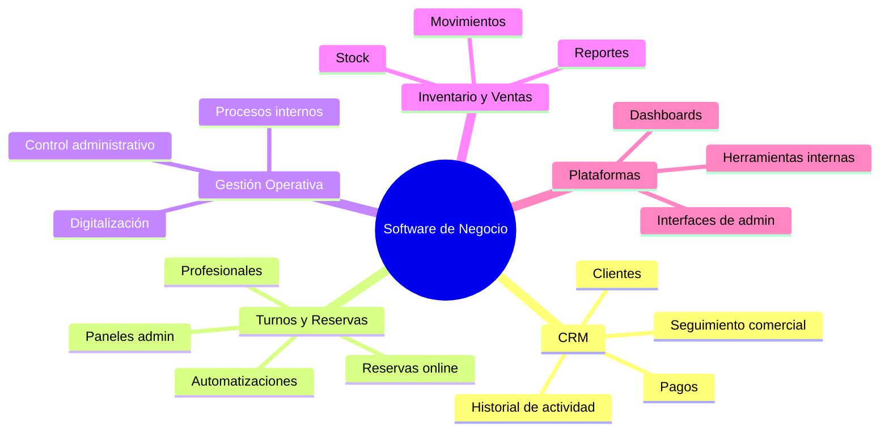
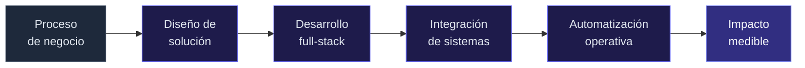

<svg xmlns="http://www.w3.org/2000/svg" viewBox="0 0 800 48" width="100%" max-width="800">
  <defs>
    <linearGradient id="line" x1="0%" y1="0%" x2="100%" y2="0%">
      <stop offset="0%" stop-color="#6366f1" stop-opacity="0"/>
      <stop offset="50%" stop-color="#6366f1"/>
      <stop offset="100%" stop-color="#6366f1" stop-opacity="0"/>
    </linearGradient>
  </defs>
  <line x1="0" y1="24" x2="800" y2="24" stroke="url(#line)" stroke-width="1"/>
  <circle cx="400" cy="24" r="3" fill="#6366f1"/>
</svg>

# Facundo Esquivel

*Desarrollador Full-Stack · Software orientado a negocios*

<svg xmlns="http://www.w3.org/2000/svg" viewBox="0 0 800 48" width="100%" max-width="800">
  <line x1="0" y1="24" x2="800" y2="24" stroke="#1e293b" stroke-width="1"/>
</svg>

 

> Diseño y desarrollo plataformas que centralizan información, automatizan procesos y dan control real sobre las operaciones de una empresa.
>
> Mi foco está en **React** y arquitecturas web modernas. Mi base incluye **PHP, WordPress y WooCommerce** — integración de sistemas, plugins e entornos empresariales complejos.

 

---

 

### Qué construyo

 

<table>
<tr>
<td width="50%" valign="top">

**CRM & comercial** — clientes, actividad, pagos e información centralizada en un solo lugar.

**Turnos & reservas** — reservas online, gestión de profesionales, servicios, pagos y automatizaciones.

</td>
<td width="50%" valign="top">

**Gestión operativa** — procesos internos, control administrativo y digitalización de tareas manuales.

**Inventario & ventas** — stock, movimientos, reportes y seguimiento comercial integrado.

</td>
</tr>
</table>

 

---

 

### Stack

<table>
<tr>
<td align="center" width="50%">

**Enfoque actual**

  

`React` · `JavaScript` · `TypeScript` · `HTML` · `CSS` · `APIs REST` · `MySQL`

</td>
<td align="center" width="50%">

**Trayectoria**

  

`PHP` · `WordPress` · `WooCommerce` · `Plugins` · `Integraciones` · `Automatizaciones`

</td>
</tr>
</table>

 

---

 

### Cómo trabajo

 

<table>
<tr>
<td align="center" width="25%"><b>Negocio primero</b> Entiendo el proceso antes del código</td>
<td align="center" width="25%"><b>Full-stack real</b> Frontend, backend e integraciones</td>
<td align="center" width="25%"><b>Automatización</b> Menos manual, más control</td>
<td align="center" width="25%"><b>Valor concreto</b> Herramientas que impactan operaciones</td>
</tr>
</table>

 

---

 

### Posicionamiento

<table>
<tr>
<td width="50%" valign="top">

**No** desarrollo sitios web informativos ni páginas corporativas sin impacto operativo.

</td>
<td width="50%" valign="top">

**Sí** construyo plataformas, CRMs, sistemas de gestión y herramientas que optimizan operaciones empresariales.

</td>
</tr>
</table>

 

---

 

[`github.com/esquivelfacundo`](https://github.com/esquivelfacundo)

