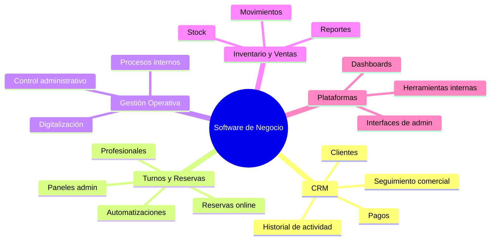
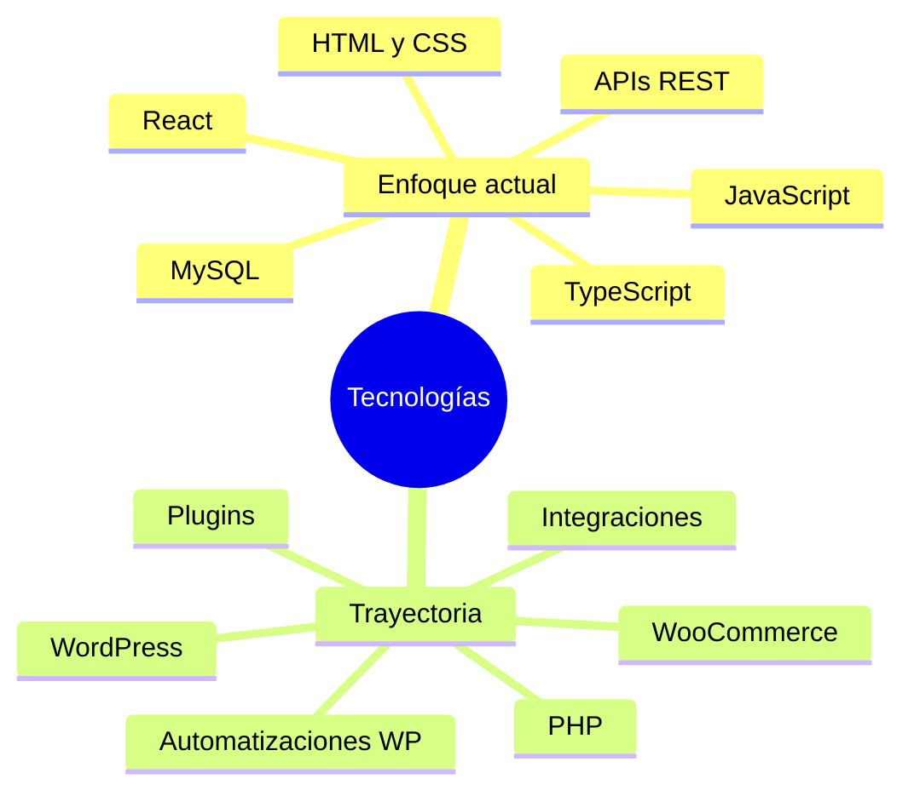
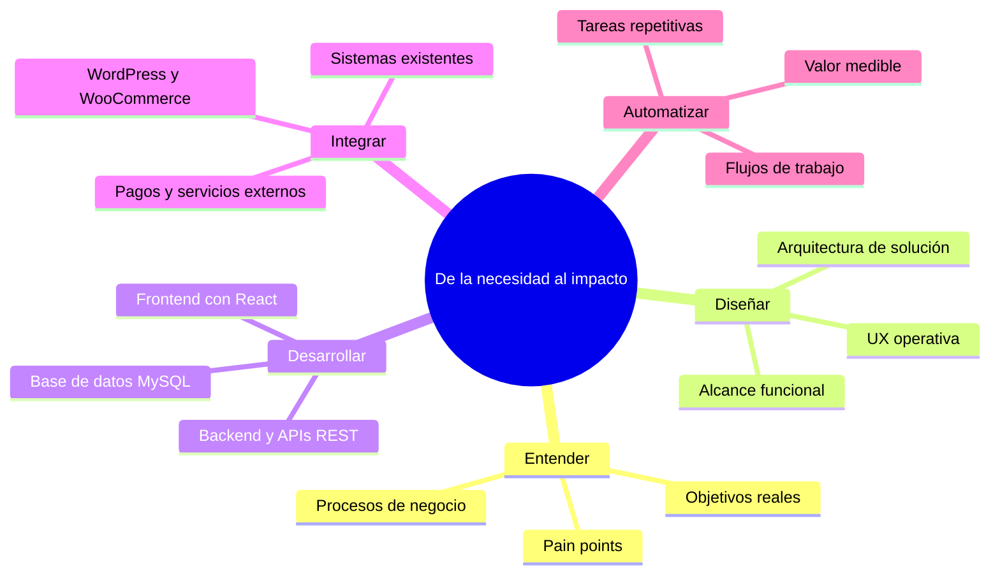
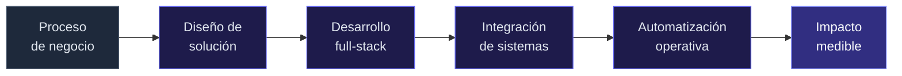
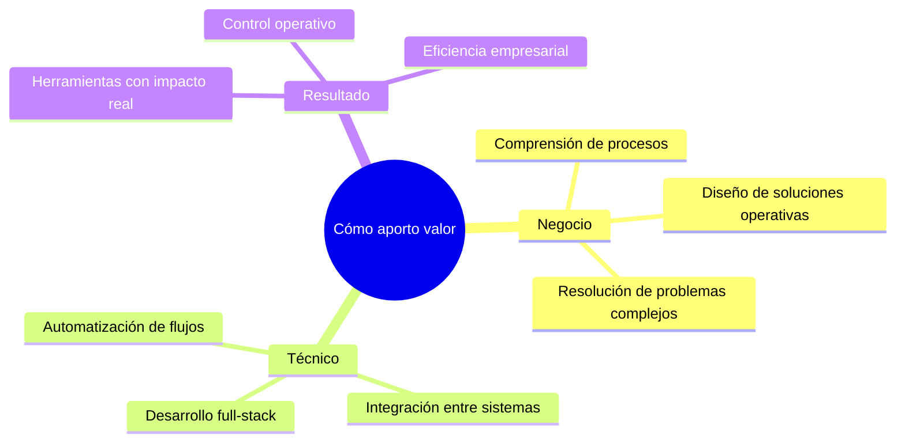

<h1 align="center">Hola 👋, soy Facundo Esquivel</h1>
<h3 align="center">Desarrollador Full-Stack · Software orientado a negocios</h3>

  

 

> **Desarrollo software que resuelve problemas reales de negocio.**
>
> No construyo sitios web. Diseño y desarrollo **plataformas operativas** — sistemas que centralizan información, automatizan procesos y dan control real a las empresas sobre sus operaciones.
>
> Mi foco actual está en **React** y arquitecturas web modernas. Mi trayectoria incluye PHP, WordPress y WooCommerce, lo que me da una base sólida para integrar sistemas y entender entornos empresariales complejos.

 

<b>🗺️ Qué construyo</b>

 

 

<table>
<tr>
<td width="50%" valign="top">

**CRM & comercial** — clientes, actividad, pagos e información centralizada.

**Turnos & reservas** — reservas online, profesionales, servicios, pagos y automatizaciones.

</td>
<td width="50%" valign="top">

**Gestión operativa** — procesos internos, control administrativo y digitalización.

**Inventario & ventas** — stock, movimientos, reportes y seguimiento comercial.

</td>
</tr>
</table>

<b>⚡ Stack tecnológico</b>

 

 

**Enfoque actual**

 

**Trayectoria & experiencia**

<b>🔄 Cómo trabajo</b>

 

 

 

<table>
<tr>
<td align="center" width="25%"><b>Negocio primero</b> Entiendo el proceso antes del código</td>
<td align="center" width="25%"><b>Full-stack real</b> Frontend, backend e integraciones</td>
<td align="center" width="25%"><b>Automatización</b> Menos manual, más control</td>
<td align="center" width="25%"><b>Valor concreto</b> Herramientas que impactan operaciones</td>
</tr>
</table>

<b>💪 Fortalezas</b>

 

<b>🎯 Posicionamiento</b>

 

 

<table>
<tr>
<td width="50%" valign="top">

**No** desarrollo sitios web informativos ni páginas corporativas sin impacto operativo.

</td>
<td width="50%" valign="top">

**Sí** construyo plataformas, CRMs, sistemas de gestión y herramientas que optimizan operaciones empresariales.

</td>
</tr>
</table>

<b>📫 Conectemos</b>

 

- 💬 Preguntame sobre React, sistemas de gestión, automatización de procesos o integración entre plataformas
- 📫 [github.com/esquivelfacundo](https://github.com/esquivelfacundo)

 

