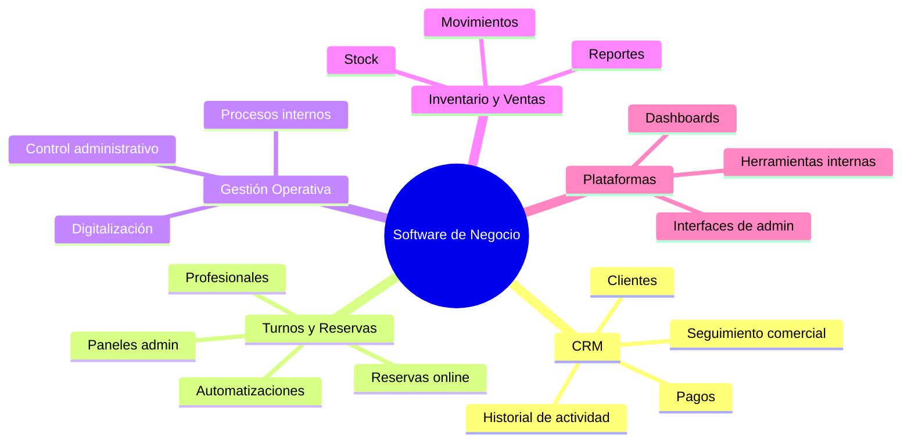
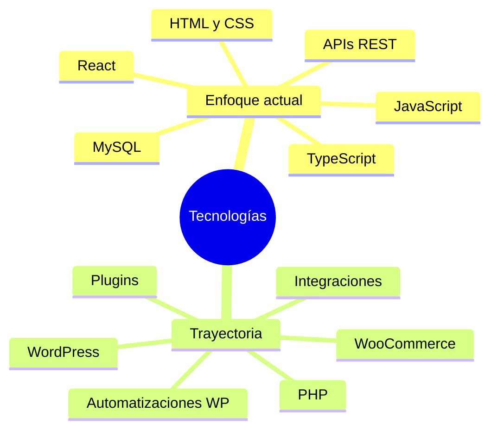
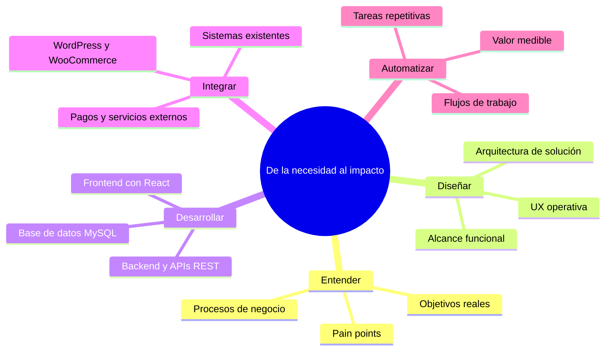
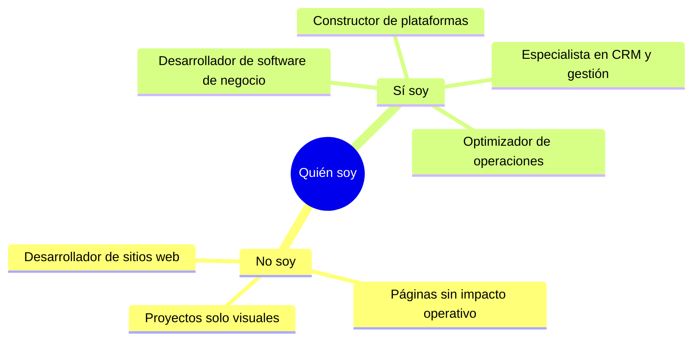

<h1>Facundo Esquivel</h1>
<h3>Desarrollador Full-Stack · Software orientado a negocios</h3>

> **Desarrollo software que resuelve problemas reales de negocio.**
>
> No construyo sitios web. Diseño y desarrollo **plataformas operativas** — sistemas que centralizan información, automatizan procesos y dan control real a las empresas sobre sus operaciones.
>
> Mi foco actual está en **React** y arquitecturas web modernas. Mi trayectoria incluye PHP, WordPress y WooCommerce, lo que me da una base sólida para integrar sistemas y entender entornos empresariales complejos.

<b>Qué Construyo</b>

<table>
<tr>
<td width="50%" valign="top">

<table>
<tr>
<td>

**CRM**

| | |
|:--|:--|
| Clientes | Gestión e historial de actividad |
| Comercial | Seguimiento, pagos e información centralizada |
| Valor | Un solo lugar para la relación con el cliente |

</td>
</tr>
</table>

</td>
<td width="50%" valign="top">

<table>
<tr>
<td>

**Turnos & Reservas**

| | |
|:--|:--|
| Reservas | Turnos online y gestión de profesionales |
| Servicios | Múltiples servicios y pagos integrados |
| Operación | Automatizaciones y paneles administrativos |

</td>
</tr>
</table>

</td>
</tr>
<tr>
<td width="50%" valign="top">

<table>
<tr>
<td>

**Gestión Operativa**

| | |
|:--|:--|
| Procesos | Operaciones internas y control administrativo |
| Eficiencia | Digitalización de tareas manuales |
| Control | Visibilidad sobre el día a día del negocio |

</td>
</tr>
</table>

</td>
<td width="50%" valign="top">

<table>
<tr>
<td>

**Inventario & Ventas**

| | |
|:--|:--|
| Stock | Control de inventario y movimientos |
| Análisis | Reportes y seguimiento comercial |
| Integración | Ventas conectadas al resto del sistema |

</td>
</tr>
</table>

</td>
</tr>
</table>

<b>Stack Tecnológico</b>

<table>
<tr>
<th align="left" width="50%">Enfoque actual</th>
<th align="left" width="50%">Trayectoria</th>
</tr>
<tr>
<td valign="top">

Aplicaciones web modernas, interfaces de administración y backends orientados a negocio.

</td>
<td valign="top">

Integraciones, e-commerce, plugins y automatizaciones en entornos empresariales existentes.

</td>
</tr>
</table>

<b>Cómo Trabajo</b>

<table>
<tr>
<th align="left" width="8%">#</th>
<th align="left" width="22%">Etapa</th>
<th align="left" width="40%">Qué hago</th>
<th align="left" width="30%">Resultado</th>
</tr>
<tr>
<td align="left">01</td>
<td>Entender</td>
<td>Mapeo de procesos, pain points y objetivos reales del negocio</td>
<td>Problema bien definido antes de codear</td>
</tr>
<tr>
<td align="left">02</td>
<td>Diseñar</td>
<td>Arquitectura de solución, UX operativa y alcance funcional</td>
<td>Sistema pensado para el uso diario</td>
</tr>
<tr>
<td align="left">03</td>
<td>Desarrollar</td>
<td>Frontend con React, backend con APIs REST y persistencia en MySQL</td>
<td>Producto funcional full-stack</td>
</tr>
<tr>
<td align="left">04</td>
<td>Integrar</td>
<td>WordPress, WooCommerce, pagos y servicios externos</td>
<td>Ecosistema conectado, no aislado</td>
</tr>
<tr>
<td align="left">05</td>
<td>Automatizar</td>
<td>Flujos de trabajo y tareas repetitivas</td>
<td>Impacto medible en operaciones</td>
</tr>
</table>

<b>Fortalezas</b>

<table>
<tr>
<th align="left" width="33%">Negocio</th>
<th align="left" width="33%">Técnico</th>
<th align="left" width="34%">Resultado</th>
</tr>
<tr>
<td valign="top">

Comprensión de procesos de negocio

Diseño de soluciones operativas

Resolución de problemas complejos

</td>
<td valign="top">

Desarrollo full-stack

Integración entre sistemas

Automatización de flujos de trabajo

</td>
<td valign="top">

Herramientas con impacto real

Control operativo para la empresa

Eficiencia en el día a día

</td>
</tr>
</table>

<b>Posicionamiento</b>

<table>
<tr>
<th align="left" width="50%">No soy</th>
<th align="left" width="50%">Sí soy</th>
</tr>
<tr>
<td valign="top">

Desarrollador de sitios web informativos

Constructor de páginas corporativas sin impacto operativo

Perfiles orientados solo a lo visual

</td>
<td valign="top">

Desarrollador de software orientado a negocios

Constructor de plataformas, CRMs y sistemas de gestión

Especialista en optimizar operaciones empresariales

</td>
</tr>
</table>

<b>Conectemos</b>

Preguntame sobre React, sistemas de gestión, automatización de procesos o integración entre plataformas.

[github.com/esquivelfacundo](https://github.com/esquivelfacundo)

