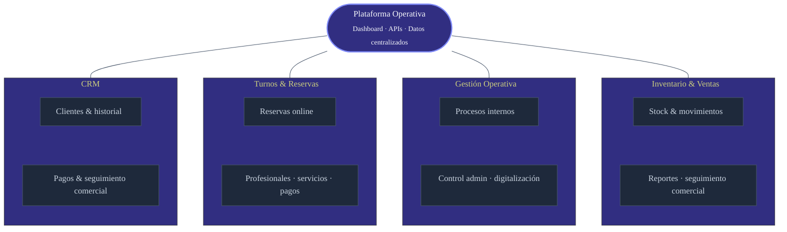
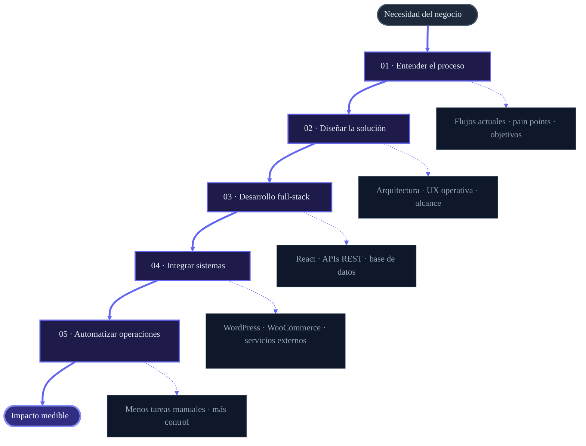
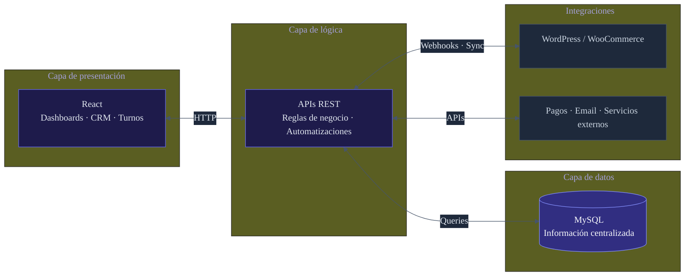

<!-- Hero Banner -->
<svg xmlns="http://www.w3.org/2000/svg" viewBox="0 0 900 220" width="100%" max-width="900">
  <defs>
    <linearGradient id="hero-bg" x1="0%" y1="0%" x2="100%" y2="100%">
      <stop offset="0%" stop-color="#0a0a0f"/>
      <stop offset="45%" stop-color="#12121a"/>
      <stop offset="100%" stop-color="#1a1a2e"/>
    </linearGradient>
    <linearGradient id="accent" x1="0%" y1="0%" x2="100%" y2="0%">
      <stop offset="0%" stop-color="#6366f1"/>
      <stop offset="50%" stop-color="#818cf8"/>
      <stop offset="100%" stop-color="#a5b4fc"/>
    </linearGradient>
    <linearGradient id="glow" x1="50%" y1="0%" x2="50%" y2="100%">
      <stop offset="0%" stop-color="#6366f1" stop-opacity="0.35"/>
      <stop offset="100%" stop-color="#6366f1" stop-opacity="0"/>
    </linearGradient>
    <filter id="blur">
      <feGaussianBlur stdDeviation="40"/>
    </filter>
  </defs>
  <rect width="900" height="220" rx="16" fill="url(#hero-bg)"/>
  <ellipse cx="750" cy="40" rx="120" ry="80" fill="#6366f1" opacity="0.12" filter="url(#blur)"/>
  <ellipse cx="150" cy="180" rx="100" ry="60" fill="#818cf8" opacity="0.08" filter="url(#blur)"/>
  <rect x="60" y="100" width="80" height="3" rx="1.5" fill="url(#accent)"/>
  <text x="60" y="78" font-family="system-ui, -apple-system, sans-serif" font-size="38" font-weight="700" fill="#f8fafc" letter-spacing="-0.5">Facundo Esquivel</text>
  <text x="60" y="130" font-family="system-ui, -apple-system, sans-serif" font-size="15" fill="#94a3b8" letter-spacing="2">FULL-STACK · BUSINESS SOFTWARE</text>
  <text x="60" y="168" font-family="system-ui, -apple-system, sans-serif" font-size="13" fill="#64748b">Plataformas · Sistemas de gestión · Automatización operativa</text>
  <rect x="60" y="188" width="780" height="1" fill="#1e293b"/>
  <circle cx="820" cy="110" r="28" fill="none" stroke="url(#accent)" stroke-width="1.5" opacity="0.6"/>
  <circle cx="820" cy="110" r="18" fill="none" stroke="#6366f1" stroke-width="1" opacity="0.3"/>
  <circle cx="820" cy="110" r="6" fill="#6366f1" opacity="0.8"/>
</svg>

 

 

### Desarrollo software que resuelve problemas reales de negocio

No construyo sitios web. Diseño y desarrollo **plataformas operativas** — sistemas que centralizan información, automatizan procesos y dan control real a las empresas sobre sus operaciones.

Mi foco actual está en **React** y arquitecturas web modernas. Mi trayectoria incluye PHP, WordPress y WooCommerce, lo que me da una base sólida para integrar sistemas y entender entornos empresariales complejos.

 

---

 

### Qué construyo

Interfaces de administración, paneles de control y herramientas internas — todo conectado a un mismo ecosistema operativo.

 

---

 

### Stack tecnológico

<!-- Current Focus -->
 

**Enfoque actual**

  

  

**Trayectoria & experiencia**

  

  

 

---

 

### Cómo trabajo

 

### Arquitectura típica

 

---

 

### Posicionamiento

<table>
<tr>
<td>

</td>
<td>
Desarrollador que arma páginas corporativas sin impacto operativo
</td>
</tr>
<tr>
<td>

</td>
<td>
Desarrollador de plataformas, CRMs, sistemas de gestión y herramientas que optimizan operaciones empresariales
</td>
</tr>
</table>

 

---

 

### Conectemos

 

Construyendo software con propósito · React · APIs · Sistemas de gestión

  

<!-- Footer wave -->
<svg xmlns="http://www.w3.org/2000/svg" viewBox="0 0 900 60" width="100%" max-width="900">
  <defs>
    <linearGradient id="footer-accent" x1="0%" y1="0%" x2="100%" y2="0%">
      <stop offset="0%" stop-color="#6366f1" stop-opacity="0"/>
      <stop offset="50%" stop-color="#6366f1" stop-opacity="0.5"/>
      <stop offset="100%" stop-color="#6366f1" stop-opacity="0"/>
    </linearGradient>
  </defs>
  <rect width="900" height="1" y="0" fill="url(#footer-accent)"/>
  <text x="450" y="35" text-anchor="middle" font-family="system-ui, sans-serif" font-size="11" fill="#475569" letter-spacing="3">FACUNDO ESQUIVEL</text>
</svg>

