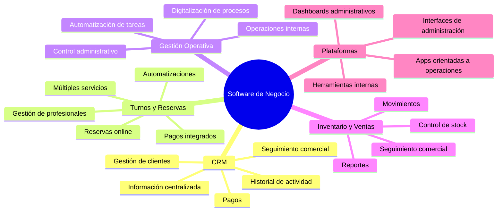
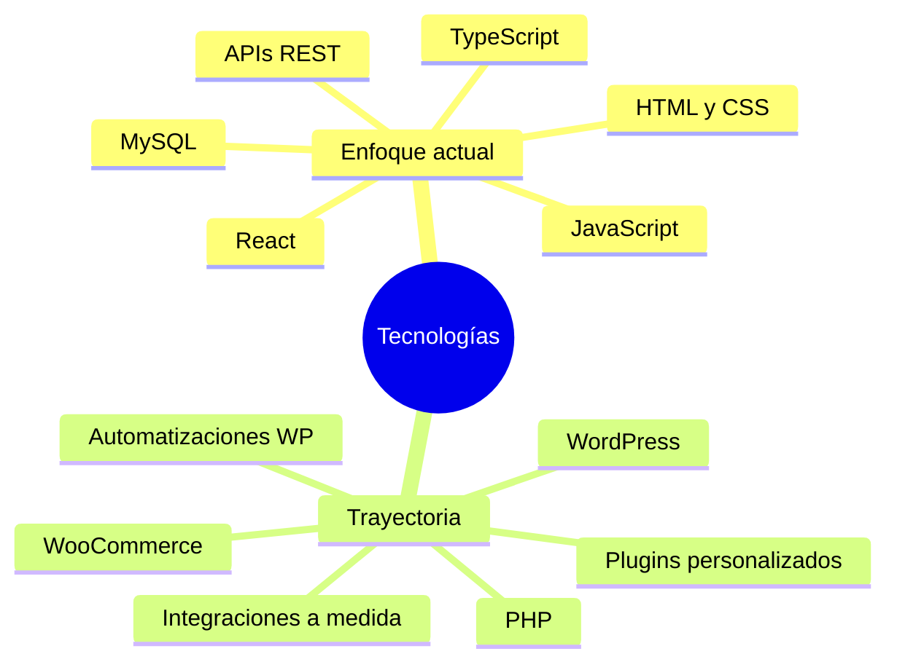
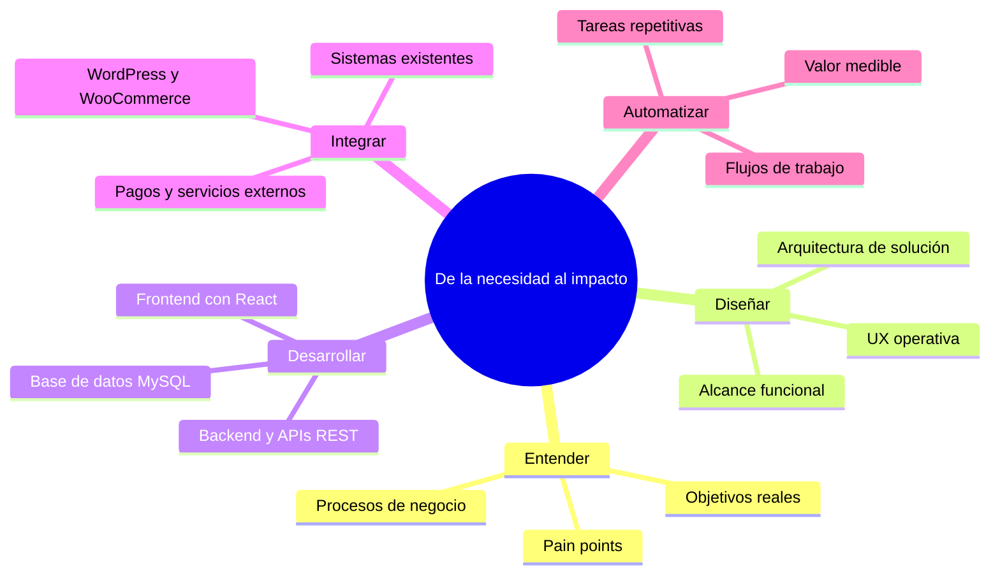
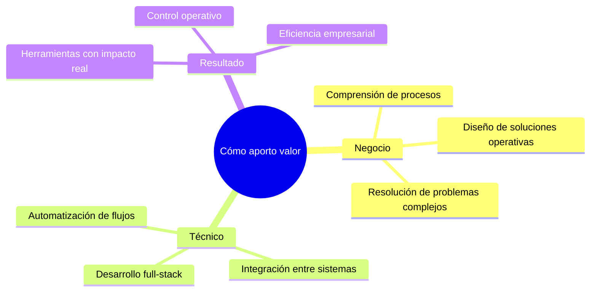
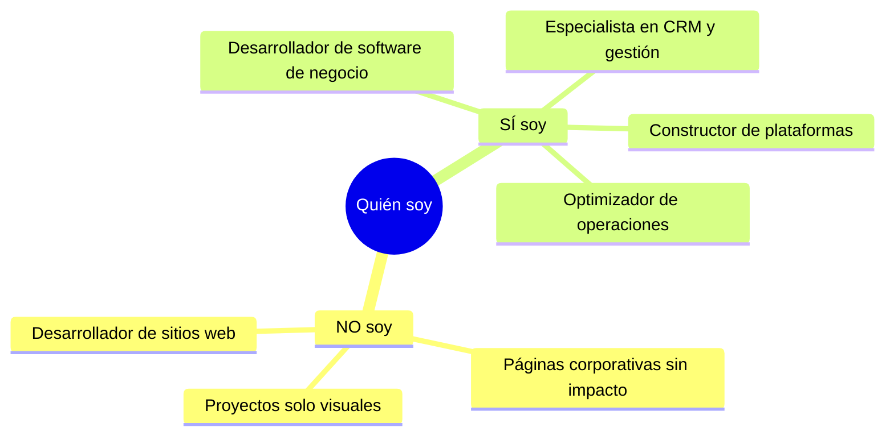

 

 

 

### Desarrollo software que resuelve problemas reales de negocio

No construyo sitios web. Diseño y desarrollo **plataformas operativas** — sistemas que centralizan información, automatizan procesos y dan control real a las empresas sobre sus operaciones.

Mi foco actual está en **React** y arquitecturas web modernas. Mi trayectoria incluye PHP, WordPress y WooCommerce, lo que me da una base sólida para integrar sistemas y entender entornos empresariales complejos.

 

---

 

### Qué construyo

 

---

 

### Stack tecnológico

 

  

 

---

 

### Cómo trabajo

 

---

 

### Fortalezas

 

---

 

### Posicionamiento

 

---

 

### Conectemos

 

